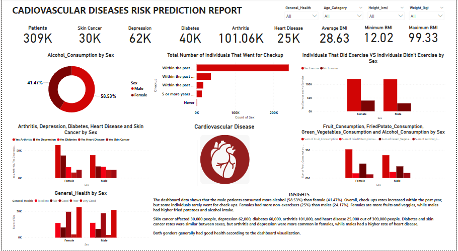

# Cardiovascular Disease Risk Prediction Report

___

## Introduction:

Understanding cardiovascular disease risk factors, early detection techniques, and viable therapies is crucial because they are a primary cause of mortality worldwide. This research is a detailed investigation of a dataset that has been carefully selected and contains a wide range of cardiovascular health-related characteristics. I hope to shed light on important facets of this important health issue through data research, visualisation, and statistical analysis. 

## Problem Statement: 
1. What is the percentage alcohol consumption of both genders?
2. Was there a huge difference between the individuals that went for check-up within the past year and the previous years?
3. What is the percentage of fruits, green vegetables, fried potatoes consumptions of both genders?
4. Total number of individuals that had cardiovascular disease?
5. Any further pertinent data-driven insights on cardiovascular disease risk prediction report?

## Skills Demonstrated:

1. Dax
2. Filter
3. Quick measure

## Data Sourcing:

The data was scrapped from the Kaggle. To clean, analyse, and visualise the data, I imported the CSV file that I had downloaded into Power Bi.

## Data Transformation/Cleaning: 

With the help of Power BI’s power query editor, the dataset was effectively cleaned and transformed.

## Data Modelling: 

There was no requirement for data modelling because the dataset just contained one sheet or table.

## Analysis and Visualization:

___

1. According to the dashboard, male patients consumed the most alcohol (58.53%), compared to female patients’ (41.47%).
2. The overall number of patients who underwent check-ups in the preceding year was comparatively higher than those who did so in the years prior. Quite a few people hardly ever went for check-ups.
3. The percentage of patients who exercised differed between genders by a slide (0.83%). When compared to male patients, female patients had the greatest percentage of non-exercisers (25%) 
4. Compared to male patients, female patients eat more fruits and vegetables. In contrast to the female patients, the male patients recorded higher levels of fried potatoes and alcohol intake. 
5. Out of the 309,000 patients, the dashboard also reveals that 30,000 had skin cancer, 62,000 were depressed, 60,000 had diabetes, 101,000 had arthritis, and 25,000 had heart disease. 
While the number of patients with diabetes and skin cancer was the same for both sexes, individuals with arthritis and depression were more common in female patients. Male patients had a disproportionately greater rate of heart disease than female ones.
6. The dashboard’s visualisation demonstrated that both genders had good general health.

## Summary:

The dashboard data shows that male patients consumed more alcohol (58.53%) than female patients (41.47%). Overall, check-up rates increased in the past year, but some individuals rarely went for check-ups. Female patients had more non-exercisers (25%) than males (24.17%). Females ate more fruits and veggies, while males had higher fried potato and alcohol intake. Skin cancer affected 30,000 patients, depression 62,000, diabetes 60,000, arthritis 101,000, and heart disease 25,000 out of 309,000 patients. Diabetes and skin cancer rates were similar between sexes, but arthritis and depression were more common in females, while males had a higher rate of heart disease. Both genders generally had good health according to the dashboard visualization.

## Conclusion and Recommendatio:

1. It is crucial to encourage alcohol awareness and moderation, especially among male patients, given that male patients ingested more alcohol than female patients. Programmes and counselling for health may be helpful.
2. Promote routine health checkups for patients, as it seems that many of them are rarely undergone. The number of checkups can be increased through health campaigns and reminders, which can help in early disease identification.
3. To encourage regular physical activity and enhance general health, take into account establishing fitness initiatives or programmes geared towards women, as the number of non-exercisers is higher among female patients.
4. Promote healthy eating habits, especially for male patients who consume more fried potatoes and alcohol than female patients. Promoting more balanced diets, with reduced fried food and alcohol consumption, can be beneficial.
5. Pay attention to the greater rates of depression and arthritis in female patients. Create resources and support groups to better care for and aid people with these diseases.
6. It’s critical to develop heart disease prevention programmes focused specifically at men, such as routine cardiovascular check-ups and lifestyle changes, given the disproportionately higher risk of heart disease among male patients.
7. Keep stressing how crucial it is for people of both sexes to maintain good general health. To preserve general wellbeing, encourage good eating, regular exercise, and balanced lives.

___

I’m open to collaborating on projects related to data analysis, and data visualization. You can reach me via email at [lindyogundokun1@gmail.com] or connect with me on LinkedIn at [https://www.linkedin.com/in/lindyogundokun] Feel free to drop me a message anytime; I’m excited to connect and collaborate with fellow data enthusiasts! Let’s work together to solve interesting data challenges!
